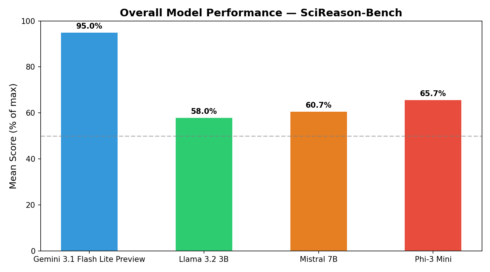
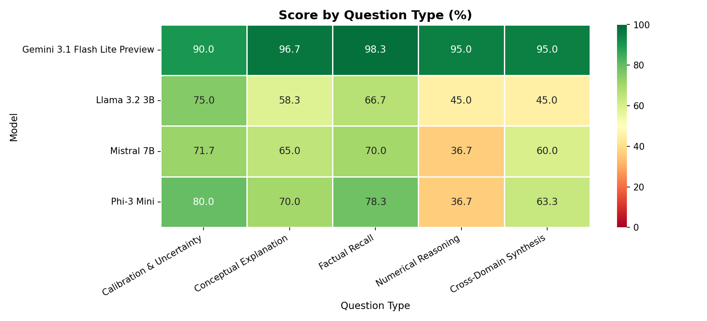
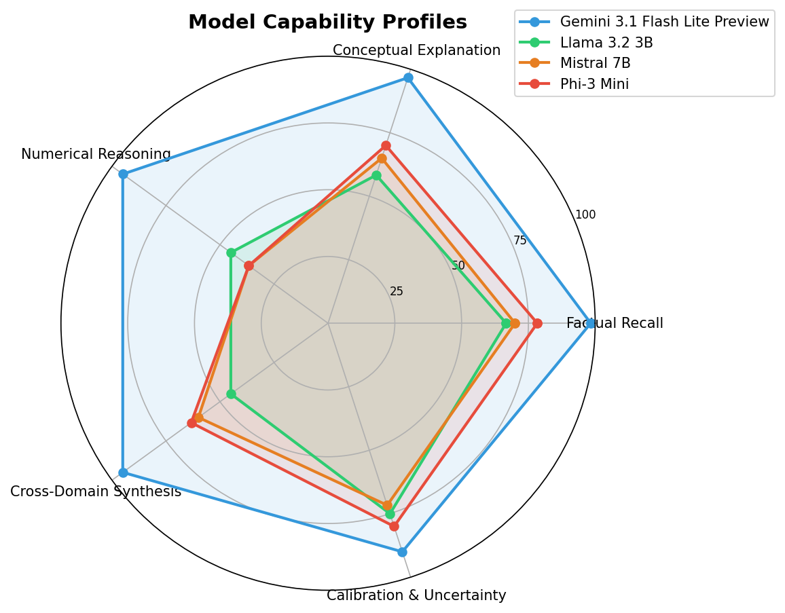
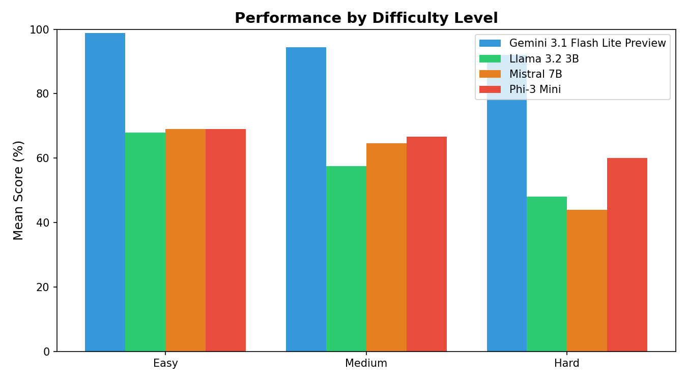
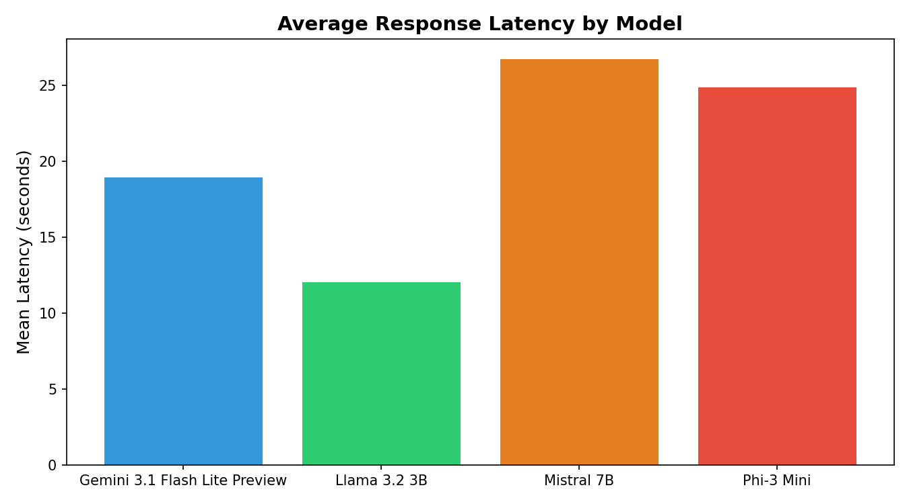

# SciReason-Bench

A structured benchmark evaluating 4 LLMs across 5 scientific reasoning question types covering AI/ML and materials science. Designed to go beyond accuracy by testing how models reason,and not just what they know.

**100 questions · 4 models · 5 question types · Scored by LLM-as-judge**

🚀 **[Live Dashboard](https://scireason-bench.streamlit.app/)**
💻 **[GitHub Repository](https://github.com/Aeesh/scireason-bench)**

---

## Research Question

*How do small open-source LLMs compare to a commercial model across different scientific reasoning tasks, and does model size predict performance consistently?*

---

## Models Evaluated

| Model | Provider | Parameters | Deployment |
|-------|----------|-----------|------------|
| Gemini 3.1 Flash Lite Preview | Google | Undisclosed | Cloud (free tier) |
| Phi-3 Mini | Microsoft | 3.8B | Local via Ollama |
| Mistral 7B | Mistral AI | 7B | Local via Ollama |
| Llama 3.2 3B | Meta | 3B | Local via Ollama |

---

## Benchmark Design

100 questions across 5 cognitive categories, 20 per type. Questions span AI/ML fundamentals, materials science, general science, and cross-domain connections between fields.

| Type | Code | Description |
|------|------|-------------|
| Factual Recall | F01–F20 | Specific facts, definitions, technical terms |
| Conceptual Explanation | C01–C20 | Explain mechanisms, compare approaches, describe trade-offs |
| Numerical Reasoning | N01–N20 | Compute metrics, estimate values, reason quantitatively |
| Cross-Domain Synthesis | S01–S20 | Connect ideas across AI, materials science, and physics |
| Calibration & Uncertainty | U01–U20 | Questions where the correct answer involves expressing doubt |

The calibration category is the most novel aspect of this benchmark. Rather than testing what models know, it tests whether they know what they don't know, which is a critical property for deployed AI systems where overconfident wrong answers erode user trust.

**Scoring:** Each response scored 0–3 by Gemini 3.1 Flash Lite Preview as LLM-as-judge, using a rubric specifying key concepts a good answer must contain. Calibration questions are scored on whether the model expresses appropriate uncertainty instead of being confidently wrong.

---

## Results

### Overall Performance

| Model | Mean Score (%) | Std Dev |
|-------|---------------|---------|
| **Gemini 3.1 Flash Lite Preview** | **95.0** | 16.67 |
| Phi-3 Mini | 65.7 | 32.64 |
| Mistral 7B | 60.7 | 31.20 |
| Llama 3.2 3B | 58.0 | 32.00 |



---

### Performance by Question Type



| Type | Gemini | Phi-3 | Mistral | Llama |
|------|--------|-------|---------|-------|
| Factual Recall | 98.3 | 78.3 | 70.0 | 66.7 |
| Conceptual Explanation | 96.7 | 70.0 | 65.0 | 58.3 |
| Numerical Reasoning | 95.0 | 36.7 | 36.7 | 45.0 |
| Cross-Domain Synthesis | 95.0 | 63.3 | 60.0 | 45.0 |
| Calibration & Uncertainty | 90.0 | 80.0 | 71.7 | 75.0 |

---

### Capability Profiles



---

### Performance by Difficulty



| Difficulty | Gemini | Phi-3 | Mistral | Llama |
|-----------|--------|-------|---------|-------|
| Easy | 98.8 | 69.0 | 69.0 | 67.9 |
| Medium | 94.3 | 66.7 | 64.5 | 57.4 |
| Hard | 92.0 | 60.0 | 44.0 | 48.0 |

---

### Latency



| Model | Mean Latency |
|-------|-------------|
| Llama 3.2 3B | ~12s |
| Gemini 3.1 Flash Lite Preview | ~19s |
| Phi-3 Mini | ~25s |
| Mistral 7B | ~27s |

Note: local model latency was measured on CPU. A GPU inference would be substantially faster.

---

## Key Findings

**1. The gap between cloud and open-source is consistently large.**
Gemini 3.1 Flash Lite Preview outperforms every open-source model by 29–37 percentage points overall. The performance gap appears consistently across all question types and difficulty levels, suggesting it is not limited to a specific task.

**2. Model size does not reliably predict performance among open-source models.**
Phi-3 Mini (3.8B) outperforms Mistral 7B (7B) overall (65.7% vs 60.7%), and Llama 3.2 3B is the weakest despite being comparable in size to Phi-3. Architecture and training data quality matter more than parameter count at this scale.

**3. Numerical reasoning is the sharpest differentiator among open-source models.**
Phi-3 and Mistral both score 36.7% on numerical reasoning, well below their factual performance. Llama scores 45.0%. These models struggle to perform multi-step quantitative reasoning even when the required knowledge is factually simple. Gemini scores 95.0% on the same questions. This gap is larger than any other category.

**4. Calibration is the relative strength of open-source models.**
All three open-source models score their highest or near-highest on calibration (Llama 75%, Mistral 71.7%, Phi-3 80%). The gap between open-source and Gemini (90%) is smallest here at 10–18 points versus 29–52 points on other categories. Open-source models tend to hedge and express uncertainty, which scores well on calibration questions, though this may partly reflect a tendency to hedge even when a confident answer is correct.

**5. Cross-domain synthesis separates Llama from Phi-3 and Mistral.**
On synthesis questions connecting AI and materials science concepts, Llama scores 45% while Phi-3 scores 63.3% and Mistral 60%. Llama appears to struggle with questions requiring integration across domains even when individual domain knowledge is adequate.

**6. Hard questions hit Mistral disproportionately.**
Mistral drops from 69% on easy to 44% on hard, a 25-point decline. Phi-3 drops only 9 points (69% to 60%) and maintains more consistent performance as difficulty increases.

---

## Limitations

**Judge bias.** All responses are scored by Gemini 3.1 Flash Lite Preview, the same model family as the evaluated Gemini model. This introduces potential self-preference bias. Human validation of a random subset would strengthen the methodology.

**Single evaluation run.** Results represent one pass per model with no repeated sampling. Variance from random decoding means individual question scores may shift on re-run. Aggregate findings are more reliable than individual question comparisons.

**Local model hardware.** Open-source models ran on CPU on a laptop. Response quality may improve modestly on GPU inference due to reduced numerical precision issues during generation.

**Benchmark scope.** 100 questions cannot be comprehensive. Materials science coverage is intentionally deeper than a general benchmark would include, which may systematically advantage or disadvantage specific models depending on their training data.

**Gemini as judge of Gemini.** The same model family serving as both evaluated model and judge is a methodological limitation. Future work should use a separate model family as judge.

---

## Project Structure

```
scireason-bench/
├── src/
│   ├── models.py          # Model query wrappers (Ollama + Gemini)
│   ├── evaluate.py        # Runs all models on benchmark
│   ├── judge.py           # LLM-as-judge scoring pipeline
│   ├── analysis.py        # Generates all charts and summary CSVs
│   └── app.py             # Streamlit dashboard
├── data/
│   └── benchmark.json     # 100 questions with expected answers and rubrics
├── results/
│   ├── scored/            # Per-model scored JSON files
│   └── analysis/          # Charts (PNG) and summary tables (CSV)
├── .env                   # GEMINI_API_KEY (not committed)
├── .gitignore
├── requirements.txt
└── README.md
```

---

## Setup

```bash
git clone https://github.com/Aeesh/scireason-bench
cd scireason-bench
python -m venv venv
source venv/bin/activate       # Mac/Linux
venv\Scripts\activate          # Windows

pip install google-genai ollama streamlit pandas matplotlib seaborn tqdm python-dotenv
```

Add Gemini API key to `.env`:
```
GEMINI_API_KEY=GEMINI_API_KEY
```

Pull local models via Ollama:
```bash
ollama pull llama3.2
ollama pull mistral
ollama pull phi3
```

---

## Running the Evaluation
```bash
# Edit MODELS_TO_RUN in evaluate.py to run one model at a time
python src/evaluate.py
```

**Score responses:**
```bash
python src/judge.py
```

**Generate analysis:**
```bash
python src/analysis.py
```

**Run dashboard:**
```bash
streamlit run src/app.py
```

---

## Technical Notes

**Gemini SDK:** Uses the new `google-genai` package (not the deprecated `google-generativeai`). Gemini 3.1 Flash Lite Preview was used as both an evaluated model and the judge due to free-tier quota constraints on newer models.

**Quota management:** Gemini 3.1 Flash Lite Preview has a 500 RPD free-tier limit. Evaluation (100 calls) and judging (400 calls) were run on separate days to stay within quota. A 5-second sleep between judge calls maintains safe RPM levels.

**Local model memory:** Running multiple large models sequentially on CPU can cause memory contention. Models were evaluated separately rather than in a single run to avoid corrupted outputs.

---

## What I Would Improve Next

- **Human validation of judge scores** on a random 20% subset to measure judge accuracy and quantify self-preference bias
- **Multiple evaluation runs** with different random seeds to establish variance estimates and confidence intervals
- **More models** including GPT-4o-mini and Claude Haiku to broaden the open vs closed comparison
- **Separate judge model** from a different model family to eliminate self-preference bias entirely
- **Error analysis** by categorising specific failure modes per model beyond aggregate scores